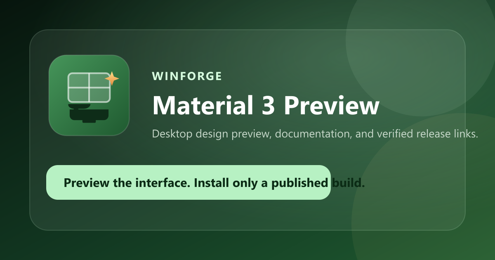

# WinForge · Material 3 Preview

WinForge · Material 3 Preview is an Electron-based desktop interface concept for Windows, accompanied by a Material Design 3 landing page and documentation surface. The current desktop package is a **preview**: controls may demonstrate intended workflows without changing the operating system.

[Open the project site](https://ding-ding-projects.github.io/material-winforge/) · [Read the documentation](docs/README.md) · [View the roadmap](ROADMAP.md)

> [!IMPORTANT]
> The website is a landing page, documentation surface, and interface preview. It is not the desktop runtime, does not embed the installed application, and does not perform Windows configuration actions.



## Install and build

A direct installer button appears on the site only after `pages/public/release-manifest.json` identifies a real published release asset. Until then, the control remains disabled rather than guessing a “latest” URL.

For local site work:

```powershell
npm --prefix pages install
npm --prefix pages run build:sites
npm --prefix pages run build:pages
```

The site toolchain is pinned to Node 22.23.2 in `pages/.node-version` and `pages/.nvmrc`. Use that runtime for both targets.

- `build:sites` produces the Cloudflare Worker-compatible Sites bundle.
- `build:pages` produces a static export in `pages/dist/client` with the `/material-winforge` base path.
- Both builds regenerate `pages/public/og.png` and the byte-identical root `social-preview.png` from the upstream WinForge brand SVG.

The desktop application uses the packaging scripts and unsigned Squirrel.Windows configuration maintained in the application package. Windows may show an unknown-publisher or SmartScreen warning for unsigned artifacts.

## What is included

- A frameless Electron preview shell based on the checked-in design export.
- A one-route vinext landing and documentation site with local-only preferences.
- English, playful Hong Kong-style Cantonese, and bilingual site language modes.
- Independent five-level English and Cantonese tone controls.
- Dockable tab navigation, command palette, and catalog search.
- An anchored JavaScript regular-expression builder with guided tokens, flags, sample text, matches, and capture groups.
- A release-manifest-aware installer control that fails closed when release evidence is absent.
- Public-safe documentation, roadmap, changelog, wiki source, and handoff records.

<details>
<summary><strong>Preview boundary and evidence</strong></summary>

The site and desktop source show intended interaction and design direction. They do not, by themselves, prove installation, operating-system mutation, automatic updating, runtime behavior, accessibility behavior, or visual fidelity in the packaged artifact.

This bootstrap intentionally does not claim tests, lint, runtime interaction, installer execution, screenshots, or visual review. Those evidence gaps remain visible in [HANDOFF.md](HANDOFF.md) and [ROADMAP.md](ROADMAP.md).

</details>

<details>
<summary><strong>Documentation map</strong></summary>

- [Application preview boundary](docs/application/preview-boundary.md)
- [Landing page behavior](docs/site/landing-page.md)
- [Local preferences](docs/site/preferences.md)
- [Search and regex builder](docs/site/search-and-regex.md)
- [Release downloads](docs/release/release-downloads.md)
- [Documentation index](docs/README.md)

</details>

<details>
<summary><strong>Repository working agreement mirror</strong></summary>

This repository follows a sanitized mirror of the shared working agreement: preserve unrelated work; use isolated branches when parallel ownership requires it; keep public records free of private machine details and credentials; use local, bundled assets; avoid code signing; document the preview boundary; keep release claims evidence-backed; and maintain current README, documentation, roadmap, handoff, wiki, and changelog records with project changes. The full repository-specific agent instructions live in [AGENTS.md](AGENTS.md).

</details>

## Captures

No verified built-artifact captures are available in this bootstrap. Future captures must come from the real packaged application at a named commit, include useful alternative text, and replace this notice only after they have been inspected. Mockups and source previews must not be presented as runtime evidence.

## Privacy and assets

The site stores presentation preferences in local browser storage. It includes no analytics, remote fonts, or third-party scripts. The WinForge logo is copied from the upstream `Ding-Ding-Projects/WinForge` asset and the social image is generated locally from that source.

## Contributing and security

See [CONTRIBUTING.md](CONTRIBUTING.md) for the development workflow and [SECURITY.md](SECURITY.md) for safe vulnerability reporting. The project is licensed under the [MIT License](LICENSE).
